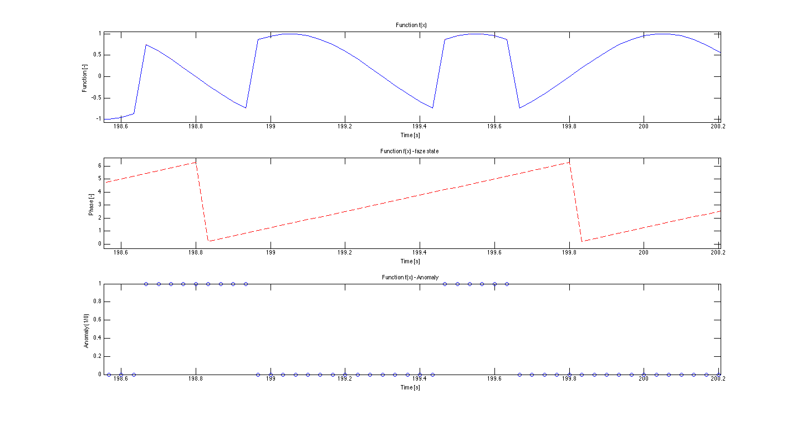

# Corrupted data - point anomaly in phase

An anomaly is added to an original clean data. In point phase anomalies we change the phase of the function at random points. We change it to a value `dF` (0..pi) for a few consecutive samples (mostly 4). The aim is to confuse the algorithm that the changed phase is the original anomaly free data (and at the correct time). 

Here, in the point anomaly, only few consecutive samples are corrupted. Therefore, the algortihm should not lose the track what the original function was. 

 
 

## Parameters
- sampling frequency : 30 Hz
- functions frequency : 1.001 Hz (Why we do so is explained in data/README.md)
- functions frequency : if `neat`, then 1 Hz
- length : specified in a data file name
- anomaly : point anomaly

## Expectations

- `local memory`: the algorithm should detect the point of phase shift as an anomaly, but then quickly realize a known sequence and start predictions according to that.
- `long-term memory`: alternatively, the algorithm should determine a known (sub)sequence (eg. downhill) and realize that it is not at the time when it should occur (there should be uphill).
- Notice the problem of "locality/scale" happens to humans as well as to neural networks :wink:

