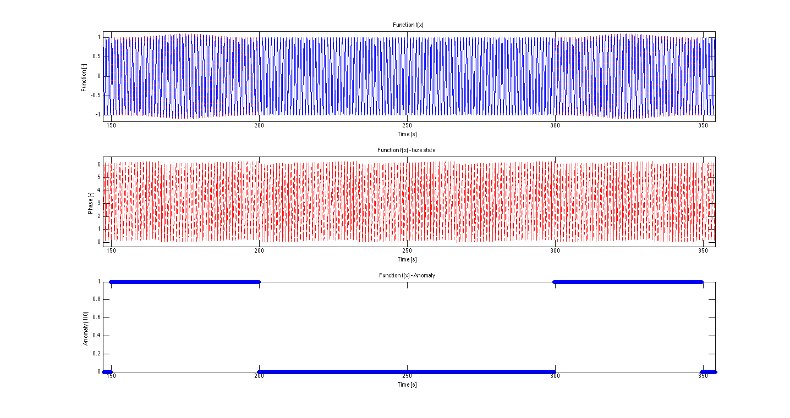
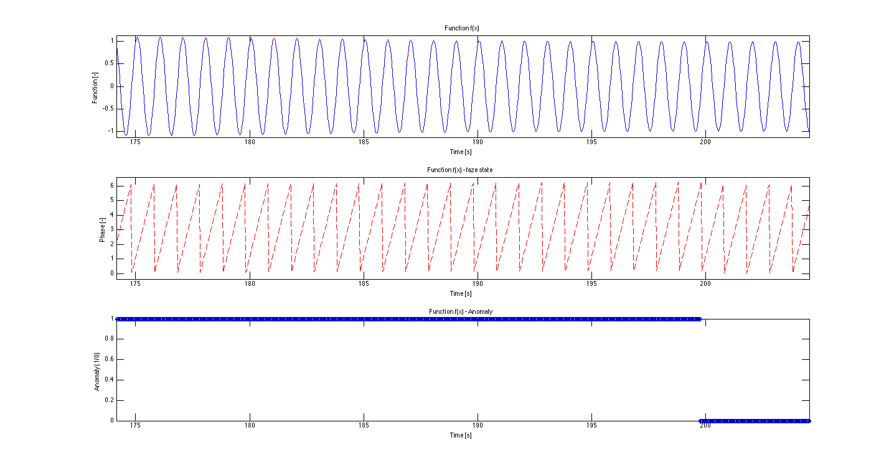

# Corrupted data - section anomaly in amplitude

Current version: So far, we only have here a gaussian amplitude increase anomaly. 

The initial motivation: consider measuring the access to a website. It varies as the day and night changes. However, if you start a PR campaign, you expect higher values which in this example are considered as anomalies because the overall tendency is not changed after the end of anomaly. The goal is that the new pattern will not be learnt.

We take the corresponding part of the data set and add the gaussian with properly set parameters so that the maximum increase is 20%. 

This is applied in two steps.

1) First, we add anomaly for 50 periods.
2) We maintain anomaly silence for 100 periods.

Note: If you do not understand the process, please check the data/datasets/corruptedData/sectionAnomaly/README.md.

 
 

## Parameters
- sampling frequency : `30 Hz`
- functions frequency : `1.001 Hz` (Why we do so is explained in data/README.md)
- length : specified in a data file name
- anomaly : section anomaly
- anomaly applied : `50 periods`
- followed by silence : `100 periods`
