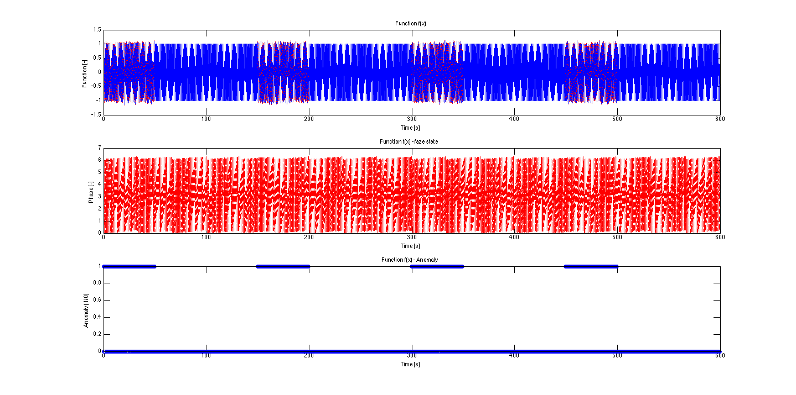
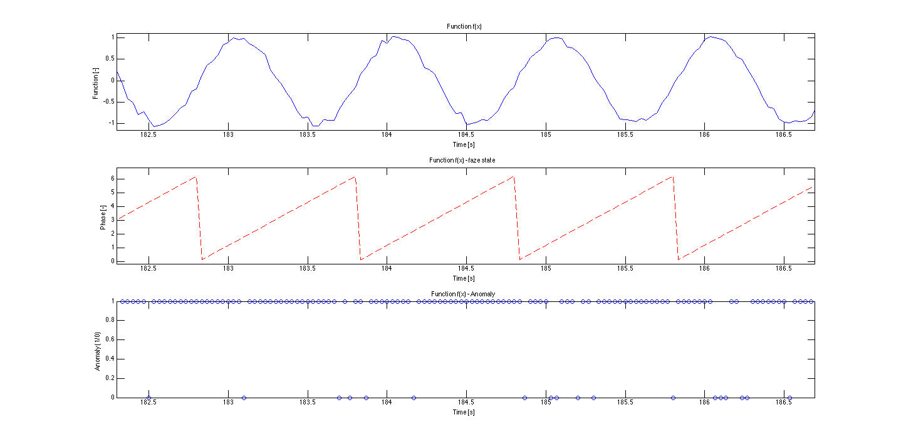

# Corrupted data - section anomaly, noisy set

We want to simulate a sensor that provides noisy data. This dataset is meant to test an method's inference and afterwards generalization. For example, think of a sensor that provides noisy data. The patterns are hidden underneath the little disturbances. In the classical approach you'd probably filter the data to make it simpler for processing. 

This is also appropriate when testing overfitting.

This anomaly is applied in two steps.

1) First, we add anomaly for 50 periods.
2) We maintain anomaly silence for 100 periods.

Note: If you do not understand the process, please check the data/datasets/corruptedData/sectionAnomaly/README.md.

 

## Parameters
- sampling frequency : 30 Hz
- functions frequency : 1.001 Hz (Why we do so is explained in data/README.md)
- length : specified in a data file name
- anomaly : section anomaly
– anomaly applied : 50 periods
- followed by silence : 100 periods
