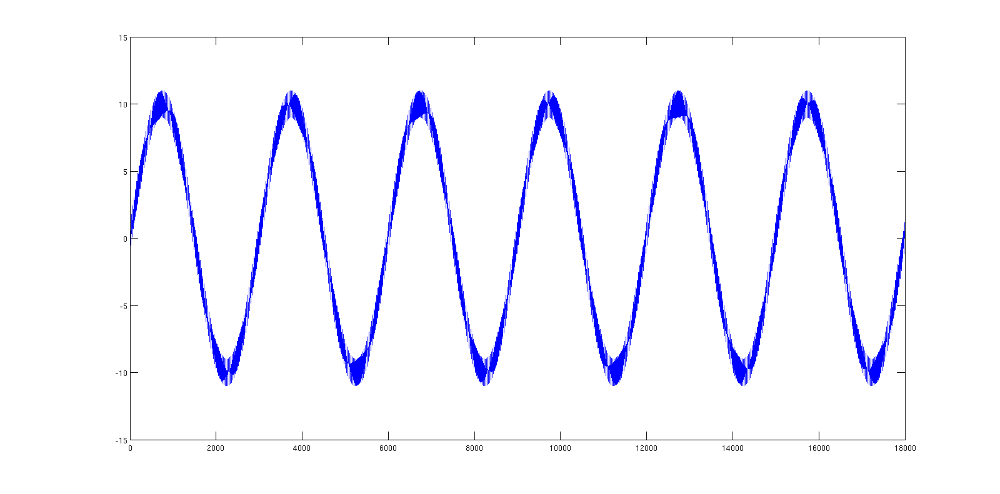
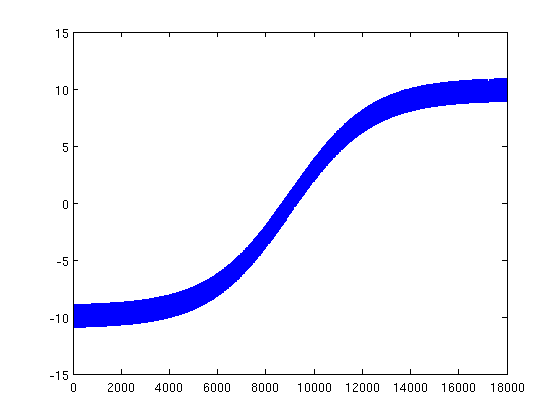
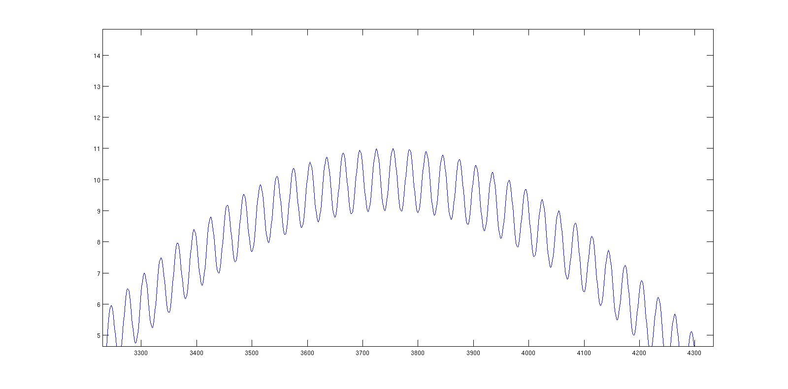
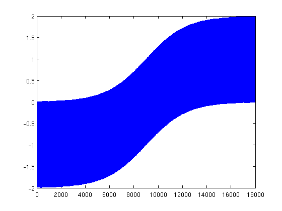
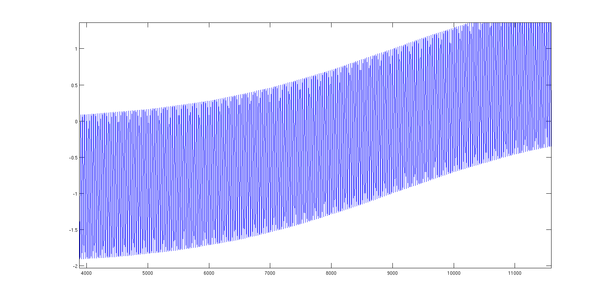

# Anomaly Trend

aka. the problem of zoom/scale/sampling. 

A mediator function `fM` is modulated by "message", a function `fL` (lowHz)

These conditions apply:
* freq. fM >> fL
* amplitude Fm << fL

## Expectations:

locality vs globality, scaling/zoom/sampling problem, ...

* on a local scale, the function would always look as fM
* on a "correct" scale (what the human would see) we can recognize `fL` trend. 
* When frequencis of fM and fL become rather similar, the "message" is lost
and the fL is undistinguishible. 
* For this task, even the "clean" data will be rather difficult! 
See images for better understanding. 

