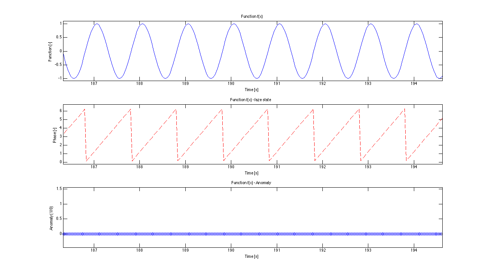

# Synthetic clean data

Synthetic clean data were created in order to represent an ideal training set. 

The appendix 'niceratio' means that the data set was generated with integer ratio fs/f. What this means is explained int the data/README.md file.

 

## Parameters
- sampling frequency : 30 Hz
- functions frequency : 1.001 Hz (Why we do so is explained in data/README.md)
- functions frequency : if 'niceratio', then 1 Hz
- length : specified in a data file name
- anomaly : no
